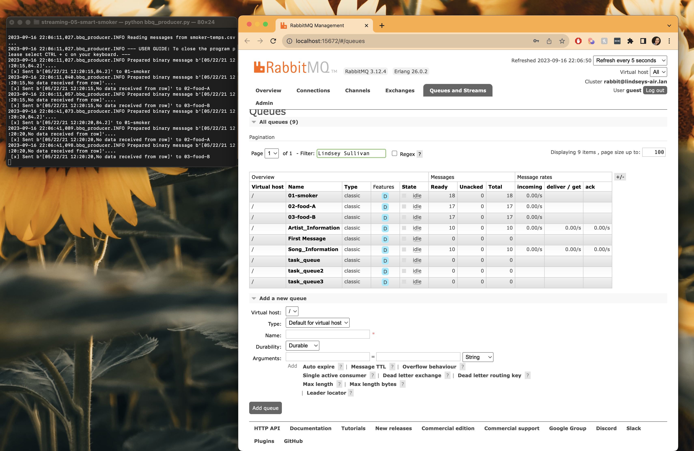

# streaming-05-smart-smoker
### Student Information:
- Lindsey Sullivan
- Date: 9/15/2023
- GitHub Repository: https://github.com/LindseySully/streaming-05-smart-smoker

# Project Prerequisites
1. Git
1. Python 3.7+ (3.11+ Preferred)
1. VS Code Editor
1. VS Code Extension: Python (by Microsoft)
1. RabbitMQ

# Getting Started
1. Fork this starter repo into your GitHub.
1. Clone your repo down to your machine.
1. View / Command Palette - then Python: Select Interpreter
1. Select your conda environment. 

# Program Details

## Project Libraries
1. sys
    - Used to provide various functions and variables that can be used to manipulate different parts of the python runtime environment
1. time
    - Used to delay the messages sent from producer.py
1. csv
    - Used to read & write to CSV files
1. os
    - Used to specify dedicated paths to directories within the project
1. pika
    - Used to implement the AMQP protocol for RabbitMQ.
1. webbrowser
    - Used to connect to the RabbitMQ Admin webpage
1. deque
    - Used to insert values and delete values.
1. JSON
    - JSON allows the convenient packaging of multiple pieces of data into one string that can be sent as a message.
    - It supports more complex data structures, like sending numbers, strings, arrays, and objects together.

## Project Files

### Producer - bbq_producer.py
This program is responsible for emit_messages from a dedicated CSV file via RabbitMQ. The program completes the following:
1. Define Constant Variables
    - INPUT_CSV_FILE: Sets the CSV file as the smoker-temps.csv
    - HOST: Localhost - can be modified for different host information
    - QUEUE1: Set dedicated queue for smoker temperatures - 01-smoker
    - QUEUE2: Set dedicated queue for food A temperature - 02-food-A
    - QUEUE3: Set dedicated queue for food B temperature - 03-food-B
1. Define Program Functions
    - offer_rabbitmq_admin_site: offers the user to open the RabbitMQ admin page
    - prepare_message: creates tuple to send message information to the appropriate queue. It then creates a binary message using .encode.
        - row: row from csv file
        - field index: specific row index for the field to pass into the message
    - send_message: connect and declare the queue and print message of what queue and server the message was sent to.
        - host (str): host name or IP address of rabbitmq server
        - queue_name (str): the name of the queue
        - message (str): message being sent
    - stream_csv_messages: read input file and send each row as a message to a dedicated queue for the worker. This program will also wait 30 seconds between messages.
        - input_file_name (str): The name of the CSV file
        - host (str): host name or IP address of the rabbitmq server
        - queue_name1 (str): the name of the queue for the first queue
        - queue_name2 (str): the name of the queue for the second queue
        - queue_name3 (str): the name of the queue for the third queue

### Consumer - bbq_consumer.py
This program is responsible for listening for messages across 3 queues
- QUEUE1: Set dedicated queue for smoker temperatures - 01-smoker
- QUEUE2: Set dedicated queue for food A temperature - 02-food-A
- QUEUE3: Set dedicated queue for food B temperature - 03-food-B

1. Define Constant Variables
    - HOST: Localhost - can be modified for different host information
    - QUEUE1: Set dedicated queue for smoker temperatures - 01-smoker
    - QUEUE2: Set dedicated queue for food A temperature - 02-food-A
    - QUEUE3: Set dedicated queue for food B temperature - 03-food-B
    - SMOKER_ALERT: Set temperature change for smoker changes less than 15 F in 2.5 minutes
    - FOOD_ALERT: Set temperature change for food changes less than 1 F in 10 minutes.
1. Define deque max length
    - smoker_temperature - Set to 5; At one reading every 1/2 minute, the smoker deque max length is 5 (2.5 min * 1 reading/0.5 min)
    - food_a_temperature - Set to 20; At one reading every 1/2 minute, the food deque max length is 20 (10 min * 1 reading/0.5 min) 
    - food_b_temperature - Set to 20; At one reading every 1/2 minute, the food deque max length is 20 (10 min * 1 reading/0.5 min) 
1. Define Functions
    - record_alert_to_csv: opens a CSV file to write the alert message to a CSV file from the queue that prompts an alert.
        - Food_stall_alerts.csv: Set for food stall alerts
        - Smoker_alerts.csv: Set for smoker stall alerts
    - smoker_callback: define behavior on getting a message from the 01-smoker queue. It looks for a potential stall if the smoker temperature decreases by more than 15 degrees in 2.5 minutes.
    - food_a_callback: define a behavior on getting a message from 02-food-A queue.
    - food_b_callback: define a behavior on getting a message from 03-food-B queue.
    - main: continuously listens for a message across 3 queues and processes a message using the appropriate callback functions.

### Screenshots

